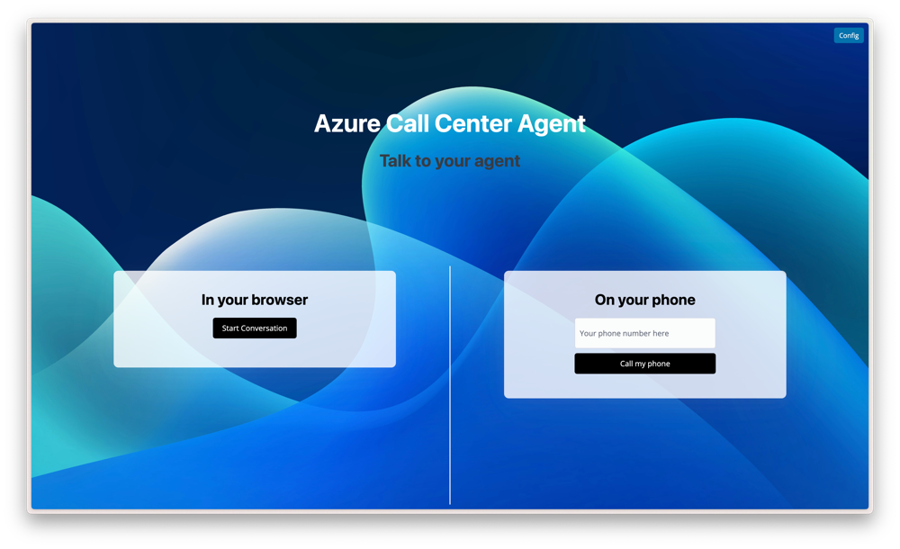

# Realtime Call Center Solution Accelerator

One-click deploy Azure Solution Accelerator for Call Center Automation with OpenAI real-time and Azure Communication Service. This solution accelerator provides a reference implementation for an AI assisted call center solution that uses Azure Communication Services to provide a voice channel for customers to interact with. The bot is able to answer questions about Microsoft Azure products for demo purposes.



## Get it running

### Set up the Azure Environment

To run this application, you can provision the resources to your Azure Subscription using the Azure Developer CLI.

From your command line:

```bash
# Login to the Azure Developer CLI
azd auth login

# Provisioon all the resources with the azure dev cli
# The following values should work:
# location=northeurope
# aiResourceLocation=swedencentral
azd up
```

#### Azure Communication Services

At the moment, the configuration of Azure Communication Services phone number is not automated. So you will need to follow the following steps manually.

1. Go to the [Azure Portal](https://portal.azure.com) and navigate to the Azure Communication Services resource that has been created
1. In the left menu, select **Phone numbers** and then click the **Get** button
1. Select a Country or region and choose **Toll free** as your number type
1. Follow the instructions to purchase a phone number
1. Add an `ACS_SOURCE_NUMBER=xxx` environment variable to the `.azure/xxx/.env` file with the phone number

### Deploy the application

To deploy the application, you can use the following script:

```bash
echo "get and set the value for AZURE_ENV_NAME"
source <(azd env get-values | grep AZURE_ENV_NAME)

# Building and deploying the user interface and the backend API
bash ./azd-hooks/deploy.sh app $AZURE_ENV_NAME
```

When successful, you will see the following output with the URL of the deployed application:

```
Deployment complete. Application URI: <YOUR_APP>.azurecontainerapps.io
```

## Local Development

Running this application locally, still requires some Azure Services in the cloud, so make sure to [set up the Azure environment](#set-up-the-azure-anvironment) first.

### Setup the local environment

If you are running this application locally, for the first time, we recommend setting up a Python environment. This only needs to be done once.

```bash
python -m venv .venv
```

Activate the local Python environment.

```bash
source .venv/bin/activate
```

Install the packages

```bash
pip install -r src/app/requirements.txt
```

Set the environment variables.

```bash
source <(azd env get-values)
azd env get-values >> .env
```

### Start the application

Start the ngrok server.

> **Hint:** We use [ngrok](https://ngrok.com/) to tunnel `localhost` to a publically available URL while developing. This is needed, as Azure Communication Services need a URL for the callbacks and to send the voice packages to. This can not be `localhost` and must be reachable from Azure Communication Services. For the first time, you might need to install ngrok and create a free account.

```bash
ngrok http http://localhost:8765
```

Override the callback urls with your ngrok url (Example: `f782-188-92-253-99.ngrok-free.app`)

For Bash:

```bash
export ACS_CALLBACK_PATH="https://<YOUR_NGROK_URL>/acs"
export ACS_MEDIA_STREAMING_WEBSOCKET_PATH="wss://<YOUR_NGROK_URL>/realtime-acs"
```

For PowerShell:

```pwsh
setx ACS_CALLBACK_PATH="https://<YOUR_NGROK_URL>/acs"
setx ACS_MEDIA_STREAMING_WEBSOCKET_PATH="wss://<YOUR_NGROK_URL>/realtime-acs"
```

Start the application

```bash
python src/app/app.py
```

---

## Contributors

(alphabetical order)

- [Carlos Raul Garcia](https://www.linkedin.com/in/carlosgarcialalicata/)
- [Sasa Juratovic](https://www.linkedin.com/in/sasajuratovic/)
- [Richard Lagrange](https://www.linkedin.com/in/richard-lagrange/)
- [Sanjay Singh](https://www.linkedin.com/in/san360/)
- [Robin-Manuel Thiel](https://www.linkedin.com/in/robinmanuelthiel/)
- [Yimi Wang](https://www.linkedin.com/in/yimiwang/)

## Related content

Based on this solution accelerator: [on-the-road copilot](https://github.com/Azure-Samples/on-the-road-copilot)

---

**Trademarks:** This project may contain trademarks or logos for projects, products, or services. Authorized use of Microsoft trademarks or logos is subject to and must follow Microsoft’s Trademark & Brand Guidelines. Use of Microsoft trademarks or logos in modified versions of this project must not cause confusion or imply Microsoft sponsorship. Any use of third-party trademarks or logos are subject to those third-party’s policies.
